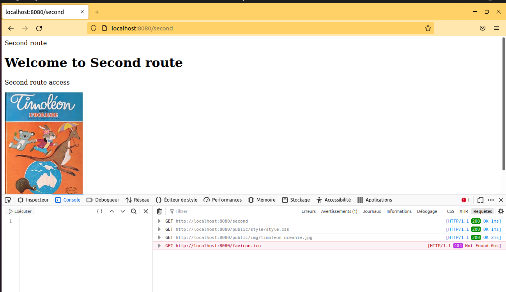

# JSFS-Adama_TRAORÉ

# CREATION DU PROJET

`$ npm init`

pour utiliser a syntaxe des modules d'ES6 nous pouvons ajouter la ligne :

`"type" : "module"` dans package.json

## il faudra créer un fichier 

`index.js`  dans lequel nous placerons la définition du serveur dans le fichier package.json  nous pouvons allons ajouter 
`"start": "node index.js",`

on peut soit demarrer le serveur par la commande 

`$ npm run start` 
soit en installant 
`nodemon` 
avec la commande 
`$ npm install nodemon --global` L'installation de ce module comme <<global>> permettra d'utiliser la commande pour tous les projets, sans réinstallation.
puis saisissons la commande 
`$ nodemon`

# Reponse des réquetes

pour avoir la reponse des requetes on tape :
### http://localhost:8080/first
### http://localhost:8080/second
### http://localhost:8080/json?value=10&color=blue

pensons à verifier que l'accès à une ressource inexistante se traduit par un échec de la requête qui la concerne.

